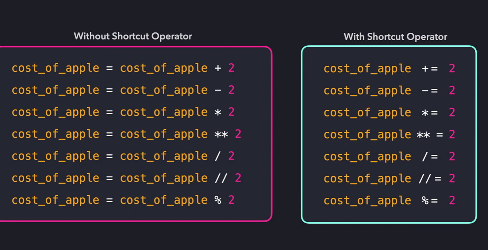
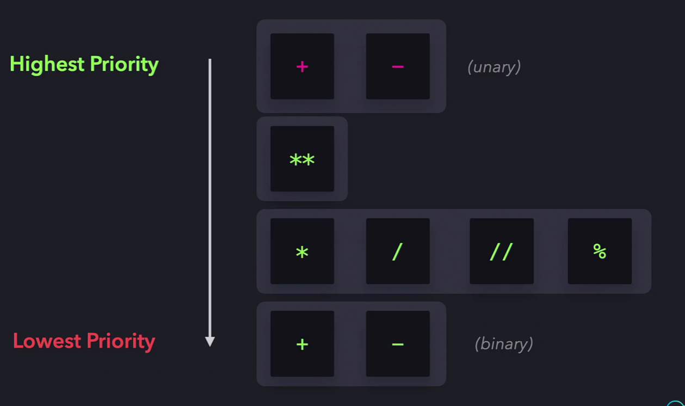

# 🐍 Python Learning Journal

## 📌 1. `print()` – Built-in Function

The `print()` function is used to display output on the screen.

### 🔹 Syntax:
```python
print(*objects, sep=' ', end='\n')
🔹 Special Characters:
\n – New line
Example:

python
Copy
Edit
print("Hello\nWorld")
# Output:
# Hello
# World
🔹 sep (Separator):
Specifies what goes between items.

python
Copy
Edit
print("2025", "07", "16", sep='-')
# Output: 2025-07-16
🔹 end:
Specifies what appears at the end of the line.

python
Copy
Edit
print("Hello", end=" ")
print("World!")
# Output: Hello World!
Literals:
Integers – without fraction (200,100023,-90,1_000_000)
Octal Number – 0o123


Operators:
Arithmetic operators -7:



Exponentials - ** (2**3)
Modulo – 5%2 =1 (provides reminder after division)
Unary and Binary operators:

 


📌 2. Variables in Python
✅ What is a Variable?
A name used to store a value in memory.

Python is dynamically typed – no need to specify data type.

✅ Examples:
python
Copy
Edit
name = "Alice"       # string
age = 25             # integer
height = 5.6         # float
is_active = True     # boolean
✅ Rules for Naming:
Must begin with a letter or underscore.

Can contain letters, numbers, and underscores.

Cannot start with a number or use Python keywords.

Valid:

python
Copy
Edit
user_name = "John"
age2 = 30
_height = 5.9
Invalid:

python
Copy
Edit
2name = "Anna"     # ❌ starts with number
for = 10           # ❌ keyword
✅ Reassignment:
python
Copy
Edit
x = 10
x = 20  # Now x is 20
✅ Multiple Assignments:
python
Copy
Edit
a, b, c = 1, 2, 3
x = y = z = 100
✅ Type Checking:
python
Copy
Edit
print(type(age))  # <class 'int'>
